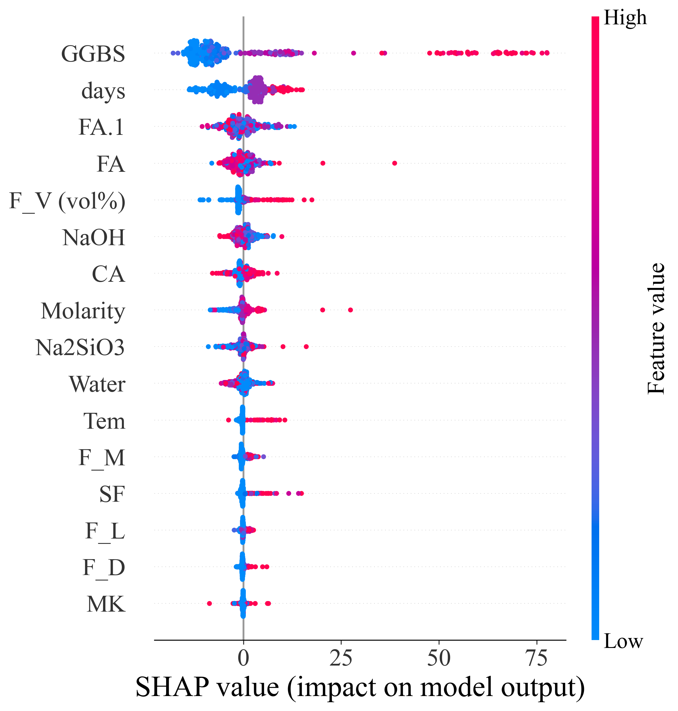

# Geopolymer Concrete ML Pipeline

**Machine Learning • Deep Learning • Generative Data Augmentation • SHAP Interpretability**

A research-oriented machine learning pipeline for predicting the compressive
strength of fiber-reinforced geopolymer concrete from mix-design, fiber, and
curing parameters.

This repository contains the computational workflow developed for my
first-author research project, including regression modeling, neural networks,
GAN-based tabular data augmentation, and SHAP-based model interpretation.

## Related Paper

M. Zhang, P. Guo, X. Tan, J. Du, W. Meng, Y. Bao,\
*Cradle-to-gate assessment and optimization of sustainable geopolymer concrete*,  
**Journal of Cleaner Production**, 2026, 538: 147387.

DOI: https://doi.org/10.1016/j.jclepro.2025.147387  
Link: https://www.sciencedirect.com/science/article/pii/S0959652625027441

> This repository focuses on the machine learning prediction, data augmentation,
> and SHAP interpretability components of the study.

## Project Overview

Implemented workflow:

- Data loading and numeric preprocessing
- Train/test split with shared configuration
- Baseline prediction with XGBoost
- Tabular data augmentation:
  - CTGAN
  - TVAE
  - Custom PyTorch GAN
- Synthetic-data filtering with a pretrained baseline model
- Augmentation-ratio experiment with LightGBM
- GAN loss visualization
- SHAP summary and scatter plots
- Result saving under `results/`

CTGAN, TVAE, and the Custom PyTorch GAN are implemented. The supplied
`main_pipeline.ipynb` is configured for `CUSTOM_GAN`, including its loss-history
plotting. Using CTGAN or TVAE may require model-specific training settings and
corresponding adjustments to loss visualization.

Implemented prediction model utilities include:

- Linear Regression
- Decision Tree
- Random Forest
- sklearn MLP baseline
- XGBoost
- LightGBM

## Example Result

The following SHAP summary illustrates the global feature contributions to the
saved compressive-strength prediction model.



*SHAP summary of the saved compressive-strength model. GGBS content and curing
age show the largest overall contributions to model predictions. Feature color
indicates lower-to-higher feature values.*

## Quick Start

Install dependencies from the project root:

```bash
pip install -r requirements.txt
```

Run the main notebook:

```bash
jupyter lab notebooks/main_pipeline.ipynb
```

The notebook is organized as:

1. Project setup and experiment parameters
2. Data loading and train/test split
3. Baseline XGBoost model
4. Custom GAN / synthesizer training
5. GAN loss curve
6. Synthetic data generation and filtering
7. Augmentation experiment
8. SHAP summary plot
9. SHAP scatter plot

## Data Format

The current public data file contains 2,307 rows, 16 input features, and one
target column.

The loader uses the first 16 columns as features and the last column as the
target. The expected target column is:

```text
Com
```

Current columns:

| Column | Meaning |
| --- | --- |
| FA | Fly ash content |
| GGBS | Ground granulated blast-furnace slag |
| SF | Silica fume |
| MK | Metakaolin |
| FA.1 | Fine aggregate content |
| CA | Coarse aggregate |
| Molarity | Alkali activator molarity |
| NaOH | Sodium hydroxide content |
| Na2SiO3 | Sodium silicate content |
| Water | Water content |
| F_V (vol%) | Fiber volume fraction |
| F_D | Fiber diameter |
| F_L | Fiber length |
| F_M | Fiber modulus |
| days | Curing age |
| Tem | Curing temperature |
| Com | Compressive strength target, MPa |

## Repository Layout

```text
data/                         Raw CSV/XLSX data
notebooks/main_pipeline.ipynb Main experiment notebook
src/config.py                 Project-level configuration constants
src/data_process.py           Data loading and numeric preprocessing
src/model_train.py            Regression models and metrics
src/data_augmentation.py      Synthetic data generation/filtering workflow
src/synthesizers.py           CTGAN/TVAE/custom GAN synthesizer factory
src/shap_analysis.py          SHAP value computation helpers
src/plotter.py                Plotting utilities
results/                      Generated tables and figures
```

## Outputs

Typical generated outputs include:

```text
results/figures/prediction/
results/figures/augmentation/
results/figures/shap/
results/figures/shap/scatter/
results/tables/
```

The main notebook uses a run timestamp in generated result filenames to organize
experiment outputs. Reusing the same run identifier or using standalone scripts
with fixed filenames may overwrite existing files.
